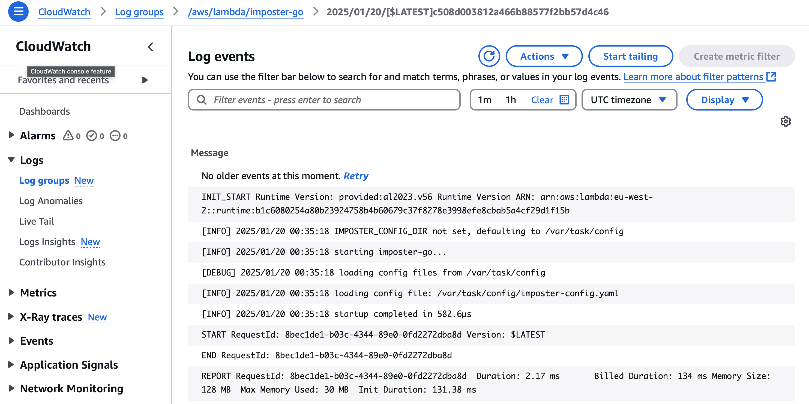
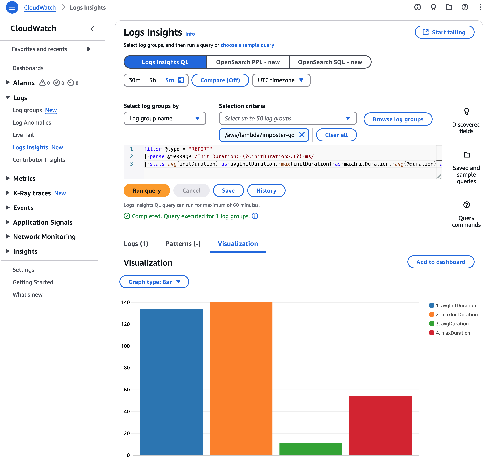

# Performance test on AWS Lambda

Test set-up:

- Configuration: [config](../config)
- AWS Lambda
  - Amazon Linux 2023 Lambda runtime
  - Lambda function memory size: 128 MB
  - Lambda function timeout: 3 seconds
- Test tool: [hey](https://hey.dev)
  - Test duration: 10 seconds
  - Test concurrency: 20

## Test results: Hit `/users` endpoint

```bash
$ hey -z 10s -c 20 https://<function-url>/users

Summary:
  Total:	10.0458 secs
  Slowest:	0.1520 secs
  Fastest:	0.0092 secs
  Average:	0.0190 secs
  Requests/sec:	2617.9973

  Total data:	2603700 bytes
  Size/request:	99 bytes

Response time histogram:
  0.009 [1]	|
  0.023 [19981]	|■■■■■■■■■■■■■■■■■■■■■■■■■■■■■■■■■■■■■■■■
  0.038 [6009]	|■■■■■■■■■■■■
  0.052 [178]	|
  0.066 [75]	|
  0.081 [40]	|
  0.095 [7]	|
  0.109 [3]	|
  0.123 [2]	|
  0.138 [2]	|
  0.152 [2]	|


Latency distribution:
  10% in 0.0127 secs
  25% in 0.0141 secs
  50% in 0.0168 secs
  75% in 0.0231 secs
  90% in 0.0276 secs
  95% in 0.0296 secs
  99% in 0.0402 secs

Details (average, fastest, slowest):
  DNS+dialup:	0.0001 secs, 0.0092 secs, 0.1520 secs
  DNS-lookup:	0.0000 secs, 0.0000 secs, 0.0124 secs
  req write:	0.0000 secs, 0.0000 secs, 0.0002 secs
  resp wait:	0.0188 secs, 0.0091 secs, 0.1520 secs
  resp read:	0.0001 secs, 0.0000 secs, 0.0058 secs

Status code distribution:
  [200]	26300 responses
```

### CloudWatch logs

CloudWatch logs for a single invocation:



### Init duration

Graph of duration and init duration for all invocations:



CloudWatch Logs Insights query to calculate the maximum init duration:

```
filter @type = "REPORT"
| parse @message /Init Duration: (?<initDuration>.*?) ms/
| stats avg(initDuration) as avgInitDuration, max(initDuration) as maxInitDuration, avg(@duration) as avgDuration, max(@duration) as maxDuration
```

### Observations

Client-side:
- 26,300 requests were processed in 10 seconds (2,617 requests per second)
- All requests returned a 200 status code
- The average response time is 19 ms (P95: 29.6 ms, P99: 40.2 ms)

Server-side:
- In AWS CloudWatch, the average Lambda response time was 10.8 ms
- In AWS CloudWatch, the maximum Lambda init duration was 140 ms, which includes the cold start time
